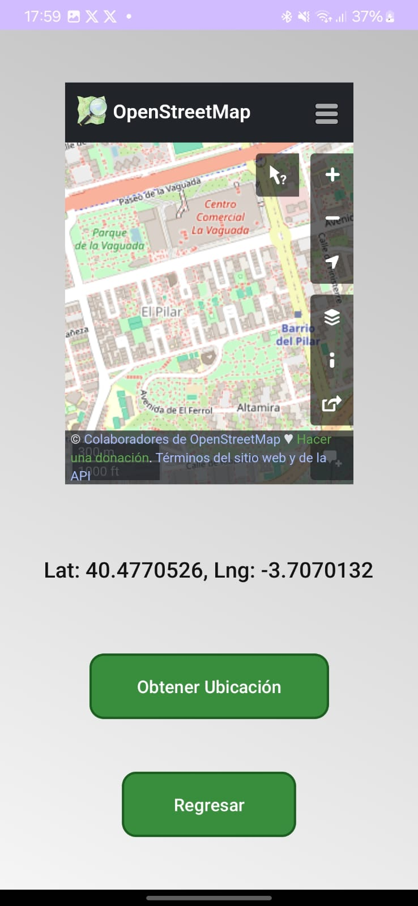

# 📌 Mad Lions App

## 🚀 Project Description
Mad Lions App is an **Android application** that allows users to **discover, add, and save points of interest**, such as **water fountains** in Madrid. The app integrates **OpenStreetMap (OSM) instead of Google Maps**, uses **Firebase Authentication**, and features a **modern UI with custom-styled components**.

## 📱 Screenshots
### 🌍 **Map with OpenStreetMap**


### 🏠 **Main Menu**


---

## 📂 **Project Structure**
```bash
📦 MadLionsApp
├── 📂 app
│   ├── 📂 src
│   │   ├── 📂 main
│   │   │   ├── 📂 java/com/example/mad_lions
│   │   │   │   ├── MainActivity.kt  # Initial screen with login/register
│   │   │   │   ├── MenuActivity.kt  # Main navigation menu
│   │   │   │   ├── LoginActivity.kt  # User authentication (Firebase)
│   │   │   │   ├── RegisterActivity.kt  # New user registration (Firebase)
│   │   │   │   ├── SavedPoints.kt  # OpenStreetMap screen with saved locations
│   │   │   │   ├── AddLocationActivity.kt  # Allows users to add new locations
│   │   │   │   ├── ImageViewActivity.kt  # Displays uploaded images
│   │   │   ├── 📂 res
│   │   │   │   ├── 📂 drawable  # Icons, backgrounds, and UI assets
│   │   │   │   ├── 📂 layout  # XML files for Activities
│   │   │   │   │   ├── activity_main.xml
│   │   │   │   │   ├── activity_menu.xml
│   │   │   │   │   ├── activity_login.xml
│   │   │   │   │   ├── activity_register.xml
│   │   │   │   │   ├── activity_saved_points.xml
│   │   │   │   │   ├── activity_add_location.xml
│   │   │   │   │   ├── activity_image_view.xml
│   │   │   │   ├── 📂 values  # Colors, strings, and styles
│   │   │   │   │   ├── colors.xml
│   │   │   │   │   ├── strings.xml
│   │   │   │   │   ├── styles.xml
│   │   │   │   │   ├── themes.xml
│   │   │   │   ├── 📂 xml  # Backup and data extraction rules
│   │   │   │   │   ├── data_extraction_rules.xml
│   │   │   │   │   ├── backup_rules.xml
│   │   │   │   │   ├── network_security_config.xml  # Security settings for network requests
│   │   │   │   ├── 📂 assets  # Static files like HTML for WebView integration
│   │   │   │   │   ├── map.html  # OpenStreetMap WebView alternative (if used)
│   │   │   ├── 📂 manifests
│   │   │   │   ├── AndroidManifest.xml  # App configuration, permissions, and Firebase setup
│   │   │   ├── 📂 gradle
│   │   │   │   ├── build.gradle  # Dependencies and build configurations
│   │   │   │   ├── gradle.properties  # Project-wide settings
│   │   │   │   ├── settings.gradle  # Module linking
│   │   │   ├── google-services.json  # Firebase authentication and database config (not included in repo)
```
---

## 📌 **Implemented Features**
### 🏠 **1. MainActivity (Home Screen)**
📌 **Features:**
- Initial screen where users can **Login** or **Register**.
- Modern, clean UI with **custom-styled buttons**.
- **Responsive design** that adapts to different screen sizes.

### 🗺 **2. SavedPoints (Map & Locations)**
📌 **Features:**
- **Uses OpenStreetMap (OSM) instead of Google Maps**.
- Displays **saved points of interest** on an interactive map.
- Users can view their **current location**.
- Allows users to **zoom and navigate freely** within the map.
- Custom **markers** are used for added locations.
- Map settings are stored locally for a **better user experience**.

### ➕ **3. AddLocationActivity (Add New Location)**
📌 **Features:**
- Allows users to **add a new location** by filling out:
  - **Name**
  - **Description**
  - **Image Upload**
- **Modern UI elements**, following Material Design.
- **Custom input fields with soft borders** for better usability.
- Users can **preview images before uploading**.
- The data is stored persistently, making it **available upon reopening the app**.

### 🔐 **4. Firebase Authentication (Login & Register)**
📌 **Features:**
- Secure **user authentication using Firebase**.
- Users can **sign in with email and password**.
- **Session persistence** ensures that users stay logged in.
- **Login and registration validation** prevents incorrect input.
- Logout functionality added in the **MenuActivity**.

### 📸 **5. ImageViewActivity (View Images)**
📌 **Features:**
- Displays **uploaded images** of saved locations.
- Users can **zoom in and view images in full-screen mode**.
- **Glide library** is used for optimized image loading and caching.

### 🏠 **6. MenuActivity (Navigation Menu)**
📌 **Features:**
- Main menu for navigation, including:
  - **View Saved Locations**
  - **Add New Locations**
  - **Logout**
- Uses **modern Material Design components** for navigation.
- A **clear structure** that allows users to access features intuitively.

---

## 📌 **Technologies Used**
- ✅ **Kotlin** (Main language)
- ✅ **Android Jetpack** (ConstraintLayout, Navigation, etc.)
- ✅ **OpenStreetMap + WebView** (Version without Google dependencies)
- ✅ Firebase Authentication (Secure login and registration system)
- ✅ Material Design Components (Buttons, UI styles, typography)
- ✅ Glide Library (For efficient image loading and caching)
---

## 🔥 **Author**
👨‍💻 **Developed by:** Manuel Neto Romero and Paul Rodriguez Isler 🚀
📅 **Date:** 24/02/2025

🚀 Enjoy the application! If you have any questions, feel free to reach out. 🔥
