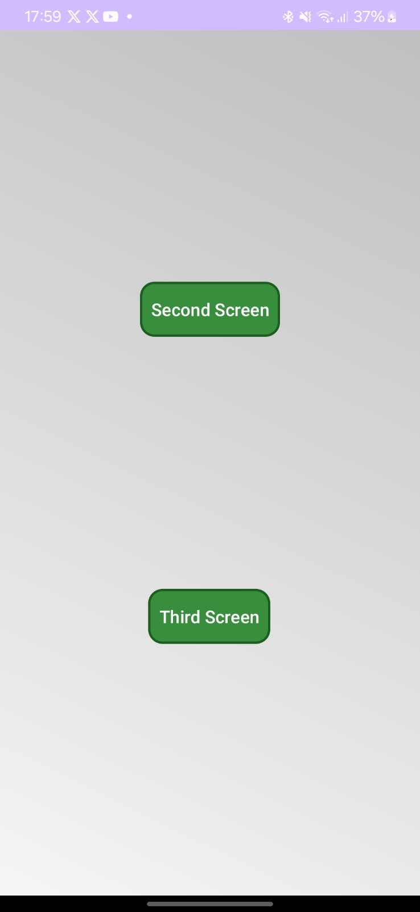

# 📌 Mad Lions App

## 🚀 Project Description
This Android application includes **three activities** with different functionalities, including the use of **Google Services** and **OpenStreetMap**. Custom-styled buttons and a clean design have been implemented for navigation.

## 📱 Screenshots
### 🌍 **Map with OpenStreetMap**


### 🏠 **Main Screen**


---

## 📂 **Project Structure**
```bash
📦 MadLionsApp
├── 📂 app
│   ├── 📂 src
│   │   ├── 📂 main
│   │   │   ├── 📂 java/com/example/mad_lions
│   │   │   │   ├── MainActivity.kt  # Main screen
│   │   │   │   ├── SecondActivity.kt  # Screen with map and location
│   │   │   │   ├── ThirdActivity.kt  # Nothing at this moment
│   │   │   ├── 📂 res
│   │   │   │   ├── 📂 drawable  # Design and styles
│   │   │   │   ├── 📂 layout  # XML files for Activities
│   │   │   │   │   ├── activity_main.xml
│   │   │   │   │   ├── second_activity.xml
│   │   │   │   │   ├── third_activity.xml
│   │   │   │   ├── 📂 values  # Colors, strings, and styles
│   │   │   │   │   ├── colors.xml
│   │   │   │   │   ├── strings.xml
│   │   │   │   │   ├── styles.xml
│   │   │   │   ├
│   │   │   │   │   
```

---

## 📌 **Implemented Features**
### 🏠 **1. MainActivity**
📌 **Description:**
- Main screen with buttons to navigate to other activities.
- Custom-styled buttons.

### 📍 **2. SecondActivity (Location and Maps)**
📌 **Description:**
- **OpenStreetMap (WebView)**
    - Loads OpenStreetMap in a WebView.
    - Displays the user’s location with a dynamic marker.
    - Communicates location from Android to JavaScript in `map.html`.

### 🔹 **3. ThirdActivity**
📌 **Description:**
- Contains an extra functionality (pending implementation).

---

## 🎨 **Design and Styles**
📌 **Custom-styled buttons with rounded corners and soft colors.**
📌 **Usage of `styles.xml` for visual consistency.**
📌 **Background with smooth gradients for better aesthetics.**

---

## 🚀 **How to Run the Project**
### 🔹 **1. Clone the Repository**
```bash
git clone https://github.com/user/MadLionsApp.git
cd MadLionsApp
```
### 🔹 **2. Open in Android Studio**
1. Open **Android Studio**.
2. Import the project from the `MadLionsApp` folder.
3. Connect a device or use an emulator.
4. Press `Run ▶` to execute the application.

### 🔹 **3. Configure Google Maps API (If Using Google Services)**
If you decide to use Google Maps instead of OpenStreetMap, add your API key in `AndroidManifest.xml`:
```xml
<meta-data
    android:name="com.google.android.geo.API_KEY"
    android:value="YOUR_API_KEY_HERE"/>
```

---

## 📌 **Technologies Used**
- ✅ **Kotlin** (Main language)
- ✅ **Android Jetpack** (ConstraintLayout, Navigation, etc.)
- ✅ **OpenStreetMap + WebView** (Version without Google dependencies)

---

## 🔥 **Author**
👨‍💻 **Developed by:** Manuel Neto Romero and Paul Rodriguez Isler 🚀
📅 **Date:** 24/02/2025

🚀 Enjoy the application! If you have any questions, feel free to reach out. 🔥
