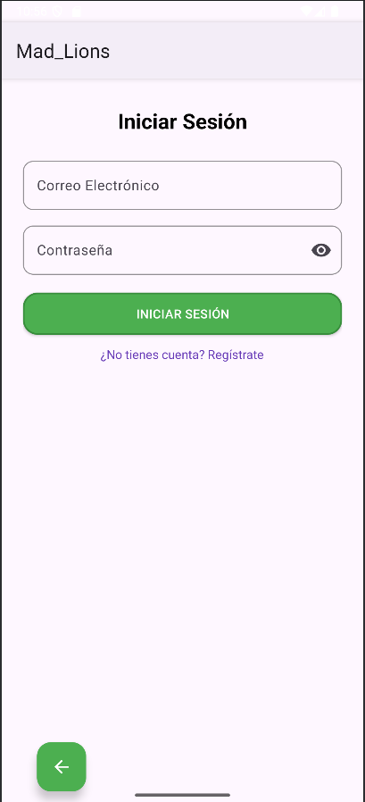
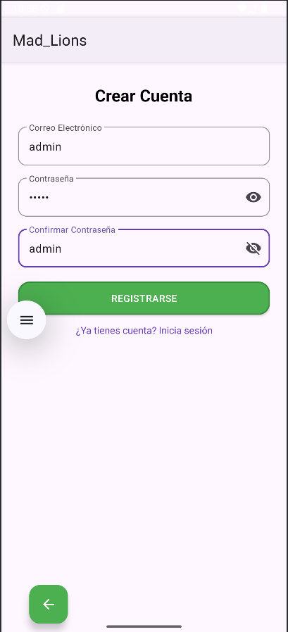
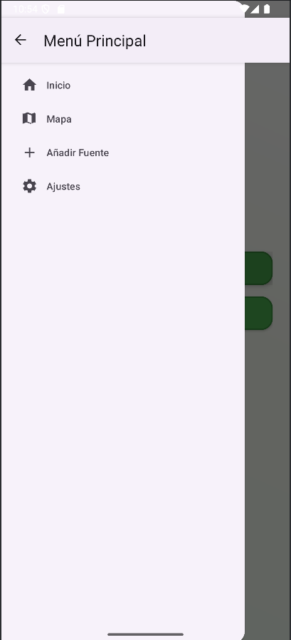
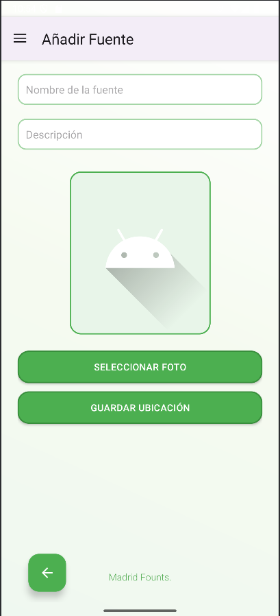
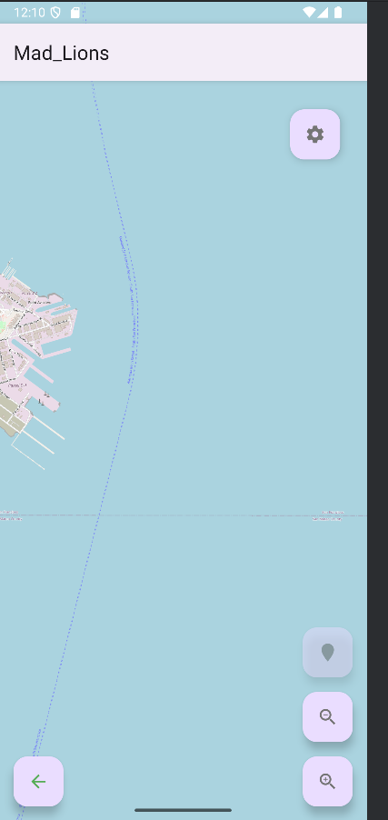
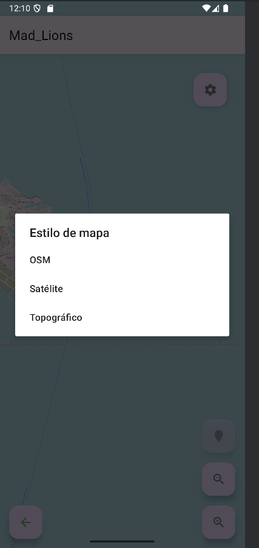
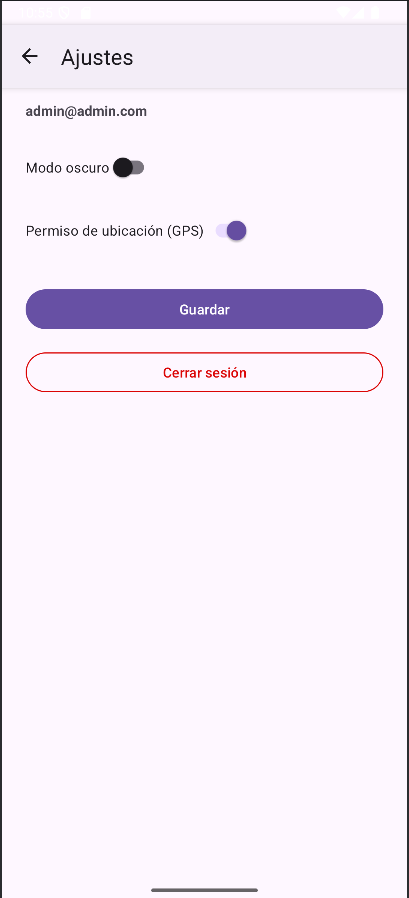

# Mad Lions App

## Workspace 
Github:  
- Repository: https://github.com/LManuXx/KotlinApp
- Workspace: https://upm365.sharepoint.com/sites/MADLions

## Description
Mad Lions App is an **Android application** that allows users to **discover, add, and save points of interest**, such as **water fountains** in Madrid. The app integrates **OpenStreetMap (OSM) instead of Google Maps**, uses **Firebase Authentication**, and features a **modern UI with custom-styled components**.

## Screenshots and navigation

<table>
  <tr>
    <td>
      
      
Login screen with fields for Email and Password (and an icon to toggle visibility), a LOG IN button, a "Register" link below, and a back‑arrow FAB in the bottom‑left.

    </td>
    <td>
      
      
Create Account screen featuring fields for Email, Password, and Confirm Password (each with visibility toggles), a REGISTER button, a "Log in" link below, an icon at the top‑left and a back‑arrow FAB in the bottom‑left.

    </td>
  </tr>
  <tr>
    <td>
      
      
Main Menu, listing four options with icons: Home, Map, Add Fountain, and Settings. A back button in the top‑left closes the drawer.

    </td>
    <td>
      
      
Add Fountain screen with an icon and title at the top, input fields for Fountain Name and Description, a placeholder to view/upload a photo, two buttons labeled SELECT PHOTO and SAVE LOCATION and a back button in the bottom‑left.

    </td>
  </tr>
  <tr>
    <td>
      
      
Interactive map view displaying OSM tiles, with a map style button to change it, a back button in the bottom‑left and three stacked buttons for "locate me", "zoom in" and "zoom out".

    </td>
    <td>
      
      
Map settings, where map view can change by "OSM", "Satellite" and "Topographic".

    </td>
  </tr>
  <tr>
    <td>
      
      
Settings screen showing the email at the top, a Dark Mode toggle, a GPS Permission toggle, a Save button and a Sign Out button, with a back arrow in the toolbar.

    </td>
  </tr>

</table>

## Demo Video

## Features
##### MainActivity (Home Screen)

- Initial screen where users can **Login** or **Register**.
- Modern, clean UI with **custom-styled buttons**.
- **Responsive design** that adapts to different screen sizes.

##### SavedPoints (Map & Locations)
- **Uses OpenStreetMap (OSM) instead of Google Maps**.
- Displays **saved points of interest** on an interactive map.
- Users can view their **current location**.
- Allows users to **zoom and navigate freely** within the map.
- Custom **markers** are used for added locations.
- Map settings are stored locally for a **better user experience**.

##### AddLocationActivity (Add New Location)
- Allows users to **add a new location** by filling out:
  - **Name**
  - **Description**
  - **Image Upload** (this is implemented but you cannot add an image due to we had to pay to allow this).
- **Modern UI elements**, following Material Design.
- **Custom input fields with soft borders** for better usability.
- Users can **preview images before uploading**.
- The data is stored persistently, making it **available upon reopening the app**.

##### Firebase Authentication (Login & Register)
- Secure **user authentication using Firebase**.
- Users can **sign in with email and password**.
- **Session persistence** ensures that users stay logged in.
- **Login and registration validation** prevents incorrect input.
- Logout functionality added in the **MenuActivity**.

##### ImageViewActivity (View Images)
- Displays **uploaded images** of saved locations.
- Users can **zoom in and view images in full-screen mode**.
- **Glide library** is used for optimized image loading and caching.

##### MenuActivity (Navigation Menu)
- Main menu for navigation, including:
  - **View Saved Locations**
  - **Add New Locations**
  - **Logout**
- Uses **modern Material Design components** for navigation.
- A **clear structure** that allows users to access features intuitively.

## How to Use
When you open the app, you’ll see **two main buttons**: Register and Log In.
- If you don’t have an account yet, tap Register, enter your email and a secure password, then hit Register—you’ll get a confirmation and land straight in the main menu.
- If you already have credentials, tap Log In, enter your email and password, and you’ll be taken to the same menu.

In the main menu you’ll see three buttons: View Map, Add Location, and Sign Out.
- **Tap Add Location to bring up a form where you type in the fountain’s name and write a short description**. As soon as the app locks onto your GPS signal, the Save Location button becomes active—tap it, and your new fountain will be saved to the community database, with a toast confirming “Location saved.”
- **Once you’ve added a fountain, head back to the menu and tap View Map**. Here you’ll find every fountain pinned on an interactive map. Your own position appears as a distinct icon surrounded by a circle showing GPS accuracy, with a compass in the top‑left and a scale bar along the bottom edge. Use the floating “+” and “–” buttons to zoom, or tap the follow‑me icon to keep the map centered on you as you move. Long‑press any spot on the map to see its exact latitude and longitude.
If you prefer a different look, tap the gear‑shaped style button in the top‑right to switch between the **default map tiles, satellite imagery, and a topographic view**. Whenever you need to go back, use the floating back arrow in the bottom‑left corner.
- When you’re done exploring, return to the main menu and **tap Sign Out to end your session.**

## Technologies Used
- ✅ **Kotlin** (Main language)
- ✅ **Android Jetpack** (ConstraintLayout, Navigation, etc.)
- ✅ **OpenStreetMap + WebView** (Version without Google dependencies)
- ✅ Firebase Authentication (Secure login and registration system)
- ✅ Material Design Components (Buttons, UI styles, typography)
- ✅ Glide Library (For efficient image loading and caching)

## Participants
List of MAD Lions App developers:
- Manuel Neto Romero (manuel.neto@alumnos.upm.es)
- Paul Brayan Rodríguez Isler (paul.rodriguez@alumnos.upm.es)  

